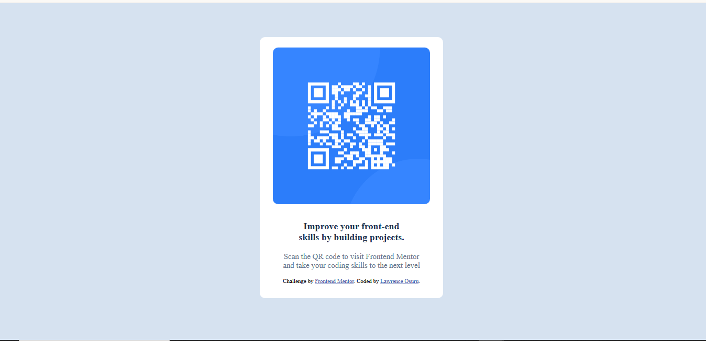
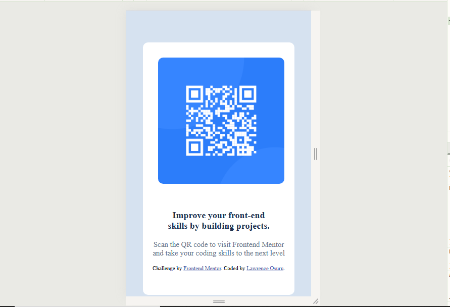

# Frontend Mentor - QR code component solution

### Screenshot

### Links

- Solution URL:
- Live Site URL: 

## My process

### Built with

- Semantic HTML5 markup
- CSS custom properties
- Flexbox

## Author

- Website - [Lawrence Osuru](https://www.your-site.com)
- Frontend Mentor - [@linscot10](https://www.frontendmentor.io/profile/linscot10)
<!-- - Twitter - [@yourusername](https://www.twitter.com/yourusername) -->

